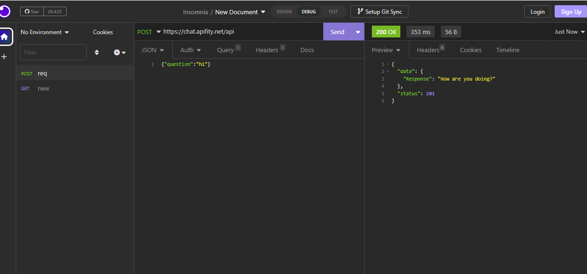

# Chat_bot_Api

## Introduction:
A chatbot API created using ChatterBot is a tool that allows developers to integrate a conversational interface into their applications. This API can be used to provide a chatbot that can engage in natural language conversations with users.

## Technologies:
- Flask  
- ChatterBot  
- Mysql database

